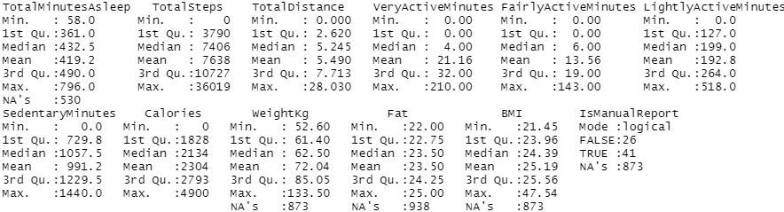
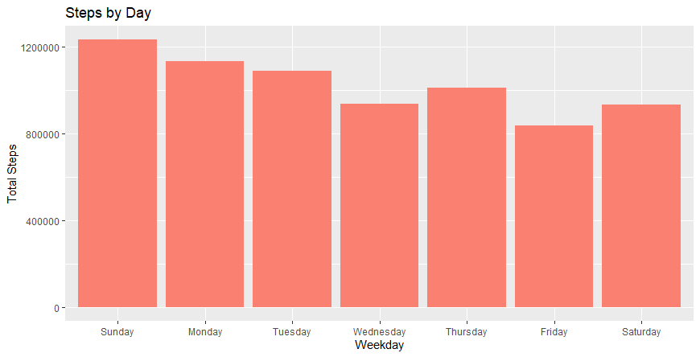
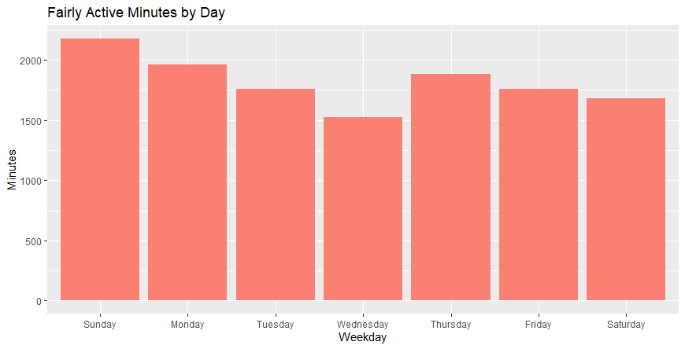
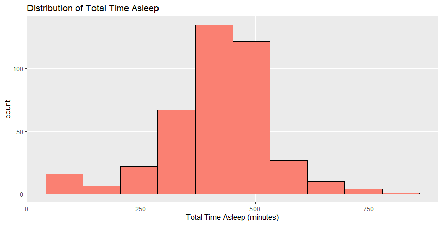
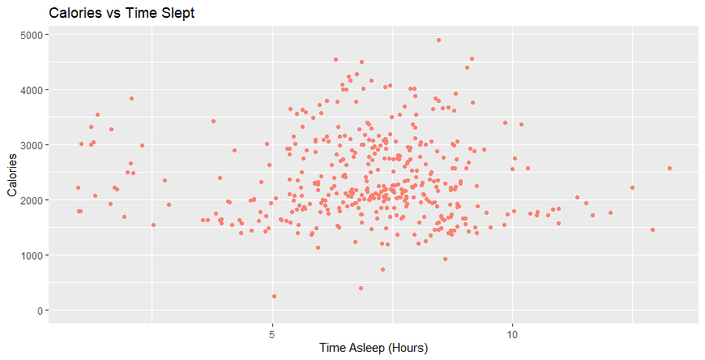

# How Can a Wellness Technology Company Play It Smart? 

## A Google Data Analytics Professional Certificate Capstone Project by Cary Htan

<div align="center">
  
</div>

[Bellabeat]( https://bellabeat.com/) is a company that develops fitness products for women. Their products include smart water bottles, fashionable fitness watches and jewelry, and yoga mats. Users can access their health data collected through these devices in the Bellabeat app.

Bellabeat’s co-founders would like to analyze data from non-Bellabeat fitness devices to see how consumers are using these products. The company hopes to use these insights to help guide new marketing strategies for the company. 

## Ask

### Key stakeholders

1. Urška Sršen: Bellabeat’s cofounder and Chief Creative Officer

2. Sando Mur: Mathematician and Bellabeat’s cofounder

3. The Bellabeat marketing analytics team: a team of data analysts responsible for collecting, analyzing, and reporting data that helps guide Bellabeat’s marketing strategy.

### Bellabeat products

* Bellabeat app: The Bellabeat app provides users with health data related to their activity, sleep, stress, menstrual cycle, and mindfulness habits. This data can help users better understand their current habits and make healthy decisions. The Bellabeat app connects to their line of smart wellness products.

* Leaf: Bellabeat’s classic wellness tracker can be worn as a bracelet, necklace, or clip. The Leaf tracker connects to the Bellabeat app to track activity, sleep, and stress.

* Time: This wellness watch combines the timeless look of a classic timepiece with smart technology to track user activity, sleep, and stress. The Time watch connects to the Bellabeat app to provide you with insights into your daily wellness.

* Spring: This is a water bottle that tracks daily water intake using smart technology to ensure that you are appropriately hydrated throughout the day. The Spring bottle connects to the Bellabeat app to track your hydration levels.

* Bellabeat membership: Bellabeat also offers a subscription-based membership program for users. Membership gives users 24/7 access to fully personalized guidance on nutrition, activity, sleep, health and beauty, and mindfulness based on their lifestyle and goals

### Business task

Analyze non-Bellabeat smart device data and compare with one Bellabeat product to discover insights to help guide marketing strategies for the company.

### Key Questions

1. What are some trends in smart device usage?
2. How could these trends apply to Bellabeat customers?
3. How could these trends help influence Bellabeat marketing strategy?

## Prepare 

### Data source: 

FitBit Fitness Tracker Data, hosted on [Kaggle]( https://www.kaggle.com/datasets/arashnic/fitbit), consists of 18 CSV files documenting smart health data from the fitness trackers of thirty users. Data acquisition was carried out through a survey on Amazon Mechanical Turk, capturing minute-level details on physical activity, heart rate, and sleep monitoring from March 12, 2016, to May 12, 2016. As of January 2024, this dataset hasn’t been refreshed in three years and includes daily records of activity, steps, and heart rate.

### Limitations: 

* The dataset includes data from only 30 individuals, which is a small sample size that might not accurately represent the larger population.

* The information is eight years old, and the FitBit devices have likely been updated to produce more accurate results.

* The survey-based collection method can introduce inaccuracies, as participants may not always provide honest or precise answers.

* Weight data is only available for eight users and contains many blank entries, with around two-thirds of the available weight data being entered manually, which could affect its reliability.

### Additional data: 

Given the constraints of the FitBit data, supplementing the analysis with an additional data source is recommended. The Mi Band fitness tracker data, available from [Kaggle](https://www.kaggle.com/datasets/damirgadylyaev/more-than-4-years-of-steps-and-sleep-data-mi-band), offers a longitudinal dataset covering steps and sleep monitoring from April 2016 to July 2022 for an individual user of the Xiaomi Mi Band. This dataset comprises two CSV files, separately detailing step counts and sleep patterns. Including this data allows for an analysis of long-term user engagement with fitness tracking on an individual level. However, it's noted by the uploader that approximately two weeks of step data were corrupted and have been set to zero.

For detailed insights into the variables and structure of the data, refer to the [Data Dictionary and Documentation](Data%20Documentation%20and%20Data%20Dictionary.md) file.

# Process

## Data files selection
The `dailyActivity_merged.csv` file is good for looking at steps and calories burned. The `sleepDay_merged.csv` file is helpful for understanding sleep. And since fitness devices are often used to track weight, the `weightLogInfo_merged.csv` file with weight information is also useful. These files together can give a good picture of health and how people use their fitness devices.

## Softwares selection
Excel will be used for early review of data, R for transformation and exploration of the data, and Tableau for visualization of the data.

## Steps for Early Review
1) Use filters to check for and remove any empty entries in the data.
2) Change the Id field to text since you don't need to do math with it.
3) Change ActivityDate from Datetime to just Date because only dates are listed.
4) Look at the `dailyActivity_merged.csv` file and note where TotalSteps is zero and SedentaryMinutes is 1440. The calories burned changes per user, likely due to differences in weight and height. Sometimes sedentary minutes are 1440 but no calories are burned.
5) Note in the `weightLogInfo_merged` file that there are only two entries for the Fat field, so it won't be much use for insights.

## Transformation and Exploration
To see R codes: [Click here](BellaBeat_RScript.R)

1) Begin by loading the tidyverse package and the data files.
2) Verify that the data has loaded as expected.
3) Change the Id field from numbers to text.
4) Update the names of ActivityDate, SleepDay, and Date to the date format.

```markdown
activity <- activity %>%
  mutate_at(vars(Id), as.character) %>%
  mutate_at(vars(ActivityDate), as.Date, format = "%m/%d/%y") %>%
  rename("Day"="ActivityDate") 
```

5) Link the data sets together using a mix of joining methods.
6) Include a new variable to indicate the day of the week.

```markdown
combined_data <- sleep %>%
  right_join(activity, by=c("Id","Day")) %>%
  left_join(weight, by=c("Id", "Day")) %>%
  mutate(Weekday = weekdays(as.Date(Day, "m/%d/%Y")))
```

7) Clean the data by eliminating duplicate rows and count the number of missing and unique Id entries.

```markdown
combined_data <- combined_data[!duplicated(combined_data), ]
sum(is.na(combined_data))
n_distinct(combined_data$Id)
n_distinct(sleep$Id)
n_distinct(weight$Id)
```

The final dataset consists of 940 variables with 25 variables. In total, there are 33 unique Id entries. The counts of distinct users in dailyActivity, sleepDay, and weightLogInfo are 33, 24, and 8, respectively. The combined data contains 6893 missing values, which is expected given the limited weight data from eight users and incomplete sleep information logging from some users.

# Analyze 

## Select summary statistics and visualizations 

```
combined_data %>%
select(TotalMinutesAsleep, TotalSteps, TotalDistance, VeryActiveMinutes, FairlyActiveMinutes, LightlyActiveMinutes, SedentaryMinutes, Calories, WeightKg, Fat, BMI, IsManualReport) %>%
summary()
```



On average, a user weighs 72.04 kg, with a BMI of 25.19, and predominantly engages in light activities. Typically, users sleep for 6.9 hours, walk 7638 steps, and cover a distance of 5.49 km each day.



Analysis reveals that users are most active on Sundays and least active on Fridays. Given the consistently high step counts, it's apparent that users find the step counting feature of fitness devices valuable. This insight suggests that similar functionalities would be appreciated by Bellabeat's customer base.



Interestingly, there is a noticeable dip in fairly active minutes during the middle of the week, particularly on Wednesdays, followed by an increase on Thursdays. This pattern might reflect a mid-week slump as individuals return to work on Monday and feel a dip in motivation or energy by midweek, using Wednesday as a rest day before resuming activities.


The histogram shows that the majority of users sleep between 312 and 563 minutes nightly, translating to about 5.2 to 9.4 hours. It's important to note that this figure does not account for total rest time, only sleep.



The majority of calories are burned by individuals who sleep between 5 and 7 hours, with few outliers. This trend is consistent with the broader 5.2 to 9.4 hours sleep range observed, indicating an optimal sleep duration for calorie expenditure.



The data indicates infrequent use of the logging feature, with many missing entries and no records for Thursdays and Fridays. The most significant logged distances occur over the weekend, suggesting that users might be more inclined to engage in physical activities during their leisure time.

## Share 

Please see dashboard image made using Tableau: [Bellabeat Dashboard](images/Dashboard.png)

## Act

* Fridays show a notable dip in physical activity among users, possibly due to accumulated fatigue throughout the week. To counteract this trend, marketing strategies might include sending motivational notifications on Thursday evenings and during the morning hours of Friday and Saturday, encouraging users to stay active.

* The underutilization of the Logged Distance feature on FitBit devices implies a preference for automatic data capture over manual inputs. Bellabeat's marketing strategy could, therefore, focus on promoting features that require minimal user intervention, sidelining the manual activity distance log function due to its apparent unpopularity.

* The dataset contains relatively few weight entries, with a majority being manually logged. This might indicate a lack of concern with weight monitoring or the absence of automatic logging tools. Bellabeat could leverage this insight by marketing devices that automatically track and log weight, like smart scales, particularly appealing to those who avoided manual logging.

* For a more comprehensive understanding and validation of trends, additional data sources such as the [Mi Band fitness tracker data (04.2016 - present)](https://www.kaggle.com/datasets/damirgadylyaev/more-than-4-years-of-steps-and-sleep-data-mi-band) could be invaluable. This dataset provides extensive insights over a multi-year span on an individual's activity and sleep patterns, offering a robust platform for comparison and analysis.

